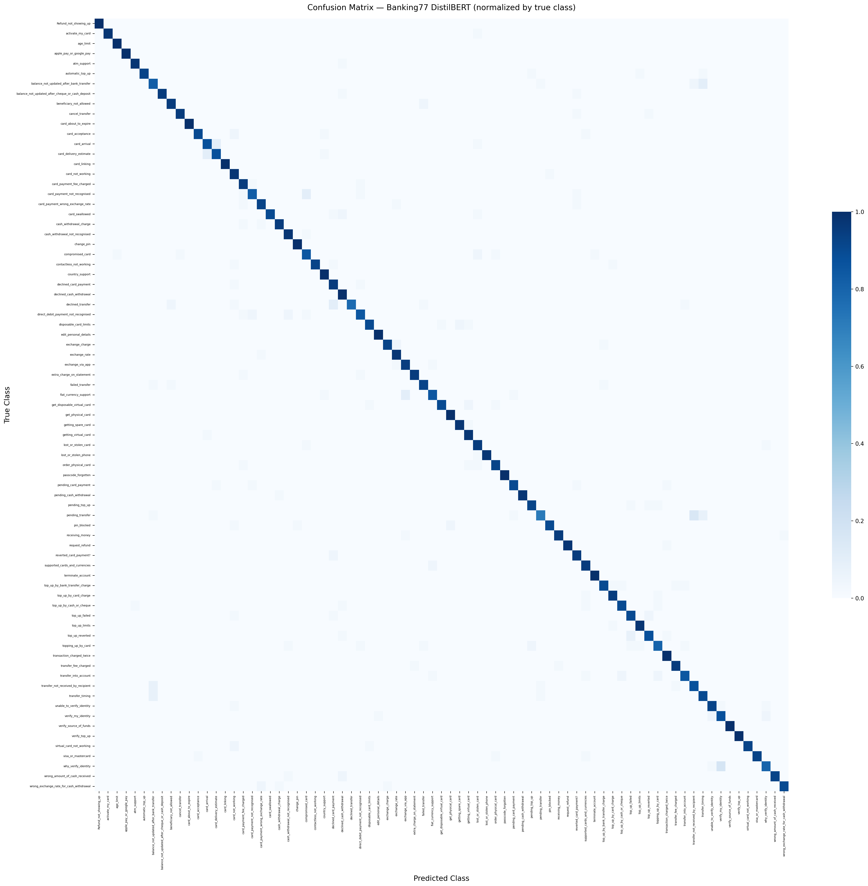
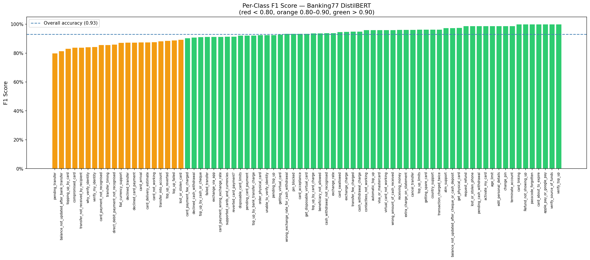
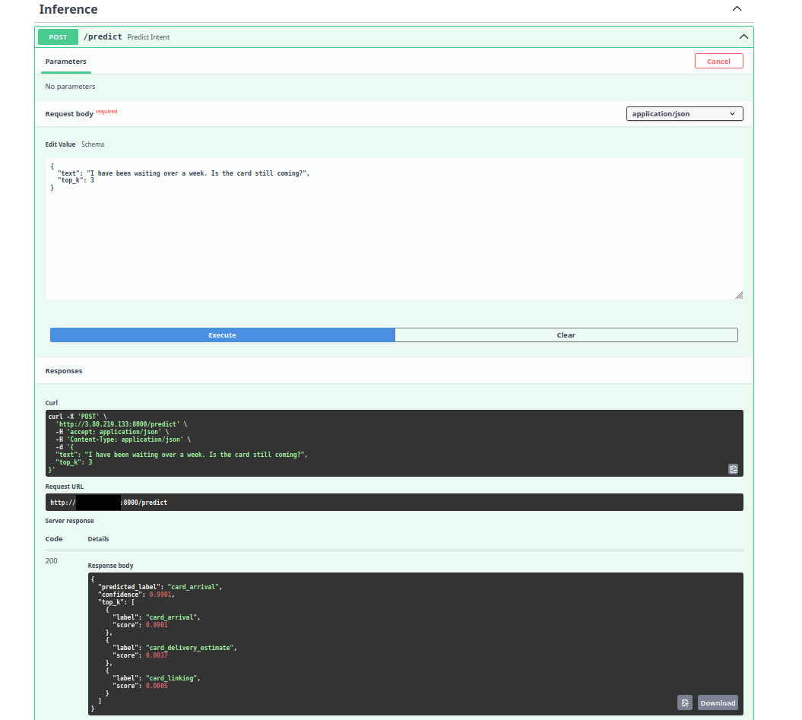

# Banking77 Intent Classifier

Fine-tuned DistilBERT on 77-class banking intent classification. **93% accuracy, 93% macro F1** on the full Banking77 test set. Deployed as a REST API with FastAPI + Docker on AWS EC2.

**Links:** [Live API](http://44.196.50.6:8000/docs) · [HuggingFace Hub](https://huggingface.co/khaze0911/banking77-distilbert)

---

## Problem Statement

Banking customer service systems need to route queries to the right team instantly. The [Banking77 dataset](https://huggingface.co/datasets/PolyAI/banking77) captures this challenge: 77 fine-grained intent classes (e.g., `card_not_working`, `transfer_fee_charged`, `exchange_rate`) across ~13k real customer queries.

Many intents are semantically adjacent (`verify_my_identity` vs. `why_verify_identity`), requiring a model that understands nuance, not just keywords.

---

## Approach

### Model
- **Base:** `distilbert-base-uncased` (66M params, 40% smaller/60% faster than BERT-base)
- **Task head:** Classification layer over 77 classes
- **Framework:** HuggingFace Transformers + PyTorch

### Training
- **Dataset:** Banking77 (~10k train / 3,076 test examples)
- **Fine-tuning:** Full model (not frozen backbone) with `AutoModelForSequenceClassification`
- **Hardware:** Single GPU, ~15 minutes training time
- **Config:** `load_best_model_at_end=True` — final weights are the best checkpoint by eval loss

### Why DistilBERT?
 Near-BERT accuracy at lower latency and memory cost. It runs comfortably on a CPU-only `t3.small` EC2 instance with sub-second inference.

---

## Results

| Metric | Score |
|--------|-------|
| Accuracy | **93%** |
| Macro F1 | **93%** |
| Test examples | 3,076 |
| Classes | 77 |

### Confusion Matrix



Nearly pure diagonal across all 77 classes. Off-diagonal mass is minimal and concentrated in semantically adjacent label pairs.

### Per-Class F1



57 of 77 classes score above 90% F1 (green). The lowest-scoring class, `pending_transfer`, sits at ~80% is still operationally useful. All orange-band classes (80–90%) share a common pattern: they involve transaction states that customers describe in overlapping language (pending, failed, declined, not recognised).

### Confusion Analysis

The top confusion pair was `why_verify_identity` ↔ `verify_my_identity` — two labels that describe nearly the same user situation from different framings. This reflects a **dataset labeling ambiguity**, not a model failure. A customer asking "why do I need to verify my identity?" and "I need to verify my identity" would be routed identically in production.

---

## Live API Demo



*"I have been waiting over a week. Is the card still coming?"* → `card_arrival` at 99.01% confidence.

---

## Architecture

```
User Request (JSON)
      │
      ▼
  FastAPI /predict  (POST)
      │
      ▼
  DistilBERT Tokenizer  (max_length=128, truncation)
      │
      ▼
  Fine-tuned DistilBERT  (77-class head, model.eval(), torch.no_grad())
      │
      ▼
  Softmax → Top-K Probabilities
      │
      ▼
  JSON Response  (predicted_label, confidence, top_k)
```

**Infrastructure:**
- Docker container → AWS EC2 `t3.small` (CPU-only, Amazon Linux 2023)
- Model weights stored in S3 (`s3://mike-kazzi-banking77/banking77-distilbert/`)
- Model card published on HuggingFace Hub

---

## API Usage

### Endpoints

| Method | Path | Description |
|--------|------|-------------|
| `POST` | `/predict` | Classify a banking query |
| `GET` | `/health` | Health check (for load balancers) |
| `GET` | `/docs` | Interactive Swagger UI |

### cURL

```bash
curl -X POST "http://44.196.50.6:8000/predict" \
  -H "Content-Type: application/json" \
  -d '{"text": "I have been waiting over a week. Is the card still coming?", "top_k": 3}'
```

**Response:**
```json
{
  "predicted_label": "card_arrival",
  "confidence": 0.9901,
  "top_k": [
    {"label": "card_arrival", "score": 0.9901},
    {"label": "card_delivery_estimate", "score": 0.0037},
    {"label": "card_linking", "score": 0.0005}
  ]
}
```

### Python

```python
import requests

response = requests.post(
    "http://44.196.50.6:8000/predict",
    json={"text": "What are the exchange rates today?", "top_k": 3}
)
result = response.json()
print(result["predicted_label"])   # exchange_rate
print(result["confidence"])        # 0.97xx
```

---

## Run Locally

### Prerequisites
- Python 3.10+
- Docker (optional, for containerized run)

### Option 1: Direct (uvicorn)

```bash
# Clone and install
git clone https://github.com/khaze0911/banking77-classifier.git
cd banking77-classifier
pip install -r requirements.txt
pip install torch --index-url https://download.pytorch.org/whl/cpu

# Download model weights from HuggingFace Hub
python -c "
from huggingface_hub import snapshot_download
snapshot_download('khaze0911/banking77-distilbert', local_dir='models/banking77-distilbert')
"

# Run (from project root — not inside app/)
uvicorn app.main:app --reload
```

API will be live at `http://localhost:8000`. Visit `/docs` for the Swagger UI.

### Option 2: Docker

```bash
# Build
docker build -t banking77-classifier .

# Run
docker run -p 8000:8000 banking77-classifier
```

---

## Project Structure

```
banking77-classifier/
├── app/
│   ├── __init__.py
│   ├── main.py          # FastAPI app, lifespan handler, routes
│   └── model.py         # Model loading and inference logic
├── assets/
│   ├── confusion_matrix.png
│   ├── per_class_f1.png
│   └── api_demo.png
├── models/
│   └── banking77-distilbert/
│       ├── config.json
│       ├── model.safetensors
│       ├── tokenizer.json
│       └── tokenizer_config.json
├── notebooks/           # Training and evaluation notebooks
├── Dockerfile
├── requirements.txt
└── README.md
```

---

## Implementation Notes

- **Singleton model loading:** `_tokenizer` and `_model` are loaded once at startup via FastAPI's `lifespan` handler. Per-request loading would add 1–2s latency per call.
- **Inference mode:** `model.eval()` + `torch.no_grad()` disables dropout and gradient computation for correct, efficient inference.
- **Top-k output:** The API returns up to 10 ranked predictions — useful for debugging borderline cases and understanding model confidence.
- **CPU-only PyTorch:** The Docker image uses the CPU-only PyTorch wheel (~1.8GB smaller than the CUDA build), appropriate for `t3.small` inference workloads.

---